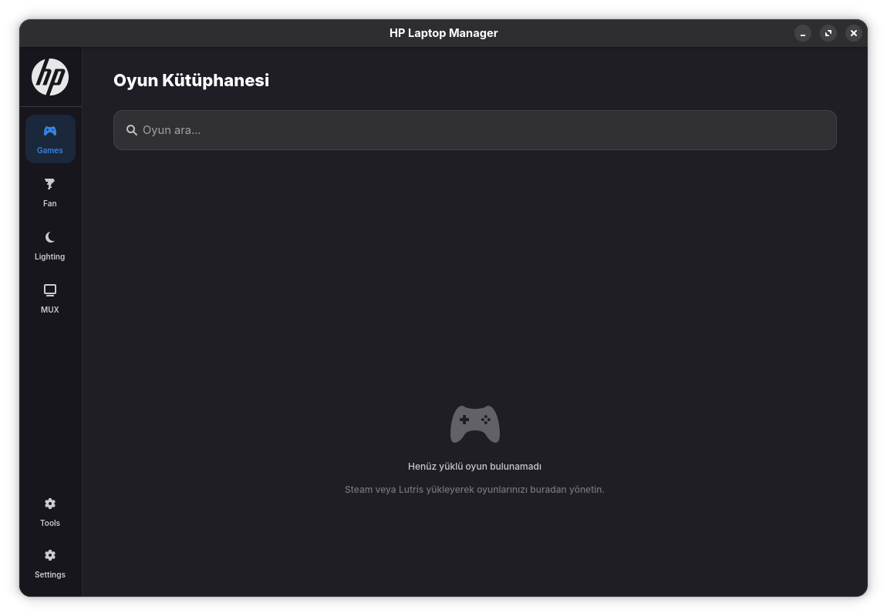
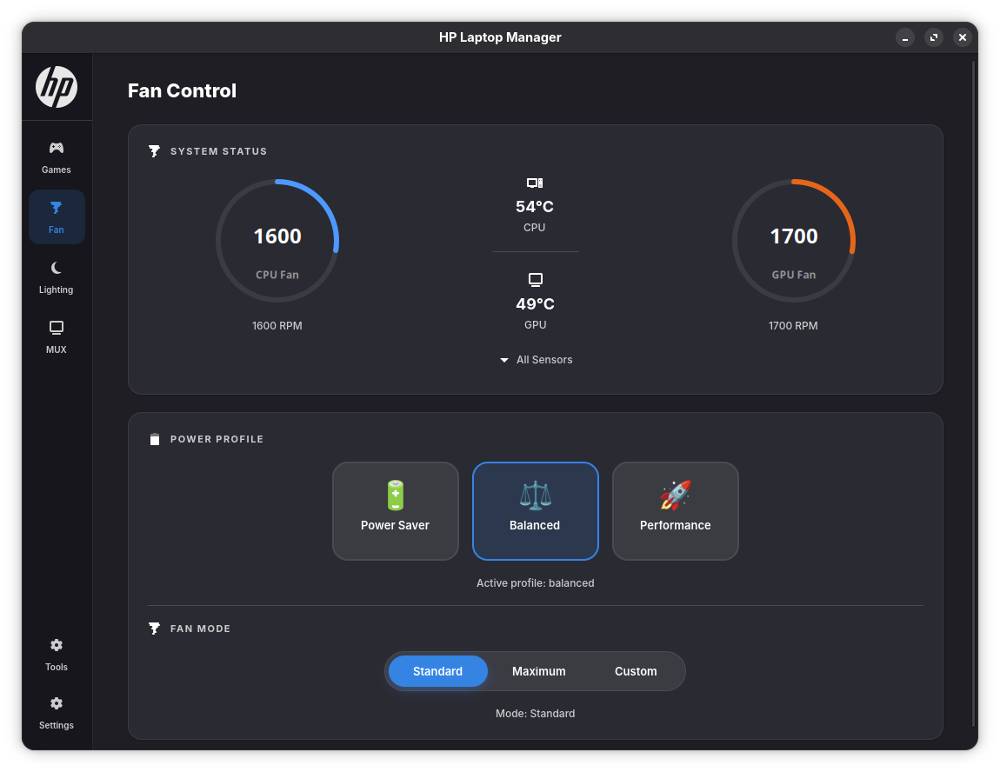
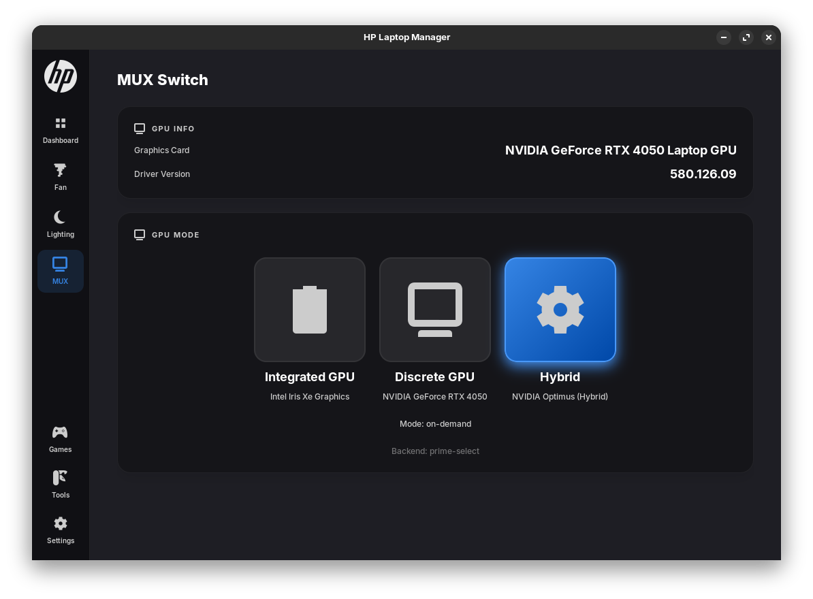
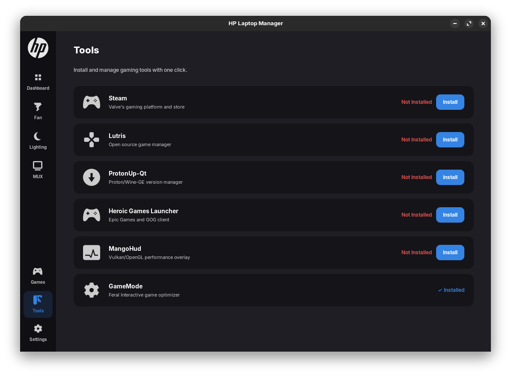

# HP Laptop Manager (Linux) v4.0
### The Missing Control Center for HP Omen & Victus Laptops on Linux


## 📖 About The Project
**HP Laptop Manager** is a native Linux application designed to unlock the full potential of HP Omen and Victus series laptops. It serves as an open-source alternative to the official OMEN Gaming Hub, providing essential controls in a modern, user-friendly interface.

**New in v4.0:**
- ✨ **Completely Redesigned UI**: Built with GTK4 and LibAdwaita for a native GNOME look.
- 🌍 **Localization**: Full support for English and Turkish languages (auto-detected).
- 🌪️ **Advanced Fan Control**: Standard (Software Curve), Max, and Custom curve editor.
- 🎨 **RGB Lighting**: 4-Zone keyboard control with effects (Static, Breathing, Wave, Cycle).
- ⚡ **Performance Modes**: Quickly switch between Power Saver, Balanced, and Performance.
- 🔧 **GPU MUX Switch**: Integrated support for hybrid/discrete graphics switching.

## ✨ Features

### 🎨 RGB Lighting Control
- **4-Zone Control**: Customize colors for different keyboard zones.
- **Effects**: Static, Breathing, Wave, Cycle.
- **Brightness & Speed**: Adjustable parameters for dynamic effects.

### 📊 System Dashboard
- **Real-time Monitoring**: CPU/GPU temperatures and Fan speeds.
- **Performance Profiles**: One-click power profile switching (requires `power-profiles-daemon`).

### 🌪️ Fan Control
- **Standard Mode**: Intelligent software-controlled fan curve for balanced noise/performance.
- **Max Mode**: Forces fans to maximum speed for intensive tasks.
- **Custom Mode**: Drag-and-drop curve editor to create your own fan profiles.

### 🎮 GPU MUX Switch
- Switch between **Hybrid**, **Discrete**, and **Integrated** modes.
- *Note: Requires compatible tools like `envycontrol`, `supergfxctl`, or `prime-select`.*

## 🚀 Installation

### Prerequisites
- A Linux distribution (Ubuntu, Fedora, Arch, OpenSUSE, etc.)
- `git` installed

### Install
Open a terminal and run:

```bash
# Clone the repository
git clone https://github.com/yunusemreyl/LaptopManagerForHP.git
cd LaptopManagerForHP

# Run the installer (requires root)
chmod +x install.sh
sudo ./install.sh
```

The installer will automatically:
1. Detect your package manager and install dependencies.
2. Install the daemon and GUI components.
3. Set up system services.
4. Provide a troubleshooting guide if issues occur.

## 🗑️ Uninstallation

To completely remove the application and its services:

```bash
cd LaptopManagerForHP
chmod +x uninstall.sh
sudo ./uninstall.sh
```

## 🐧 Compatibility

| Distribution | Status | Notes |
|--------------|--------|-------|
| **Ubuntu 24.04 LTS** | ✅ Verified | Full support via `apt` |
| **Fedora 40+** | ✅ Verified | Full support via `dnf` |
| **Arch Linux / CachyOS** | ✅ Verified | Full support via `pacman` |
| **Zorin OS / Pop!_OS** | ✅ Verified | Native support |
| **OpenSUSE Tumbleweed** | ✅ Verified | Full support via `zypper` |

## 📸 Screenshots

<p align="center">
  
  
</p>
<p align="center">
  
  
</p>
<p align="center">
  
  
</p>

## 👨‍💻 Credits & Acknowledgments
- **Lead Developer**: [yunusemreyl](https://github.com/yunusemreyl)
- **Kernel Module Development**: Special thanks to **[TUXOV](https://github.com/TUXOV/hp-wmi-fan-and-backlight-control)** for the `hp-wmi-fan-and-backlight-control` driver, which makes fan control possible.
- **RGB Driver Inspiration**: [hp-laptop-rgb-controller](https://github.com/dmitry-s93/hp-laptop-rgb-controller)
- **Kernel Module Reference**: [hp-omen-linux-module](https://github.com/homen-linux/hp-omen-linux-module)

## ⚖️ Legal Disclaimer
This tool is an independent open-source project developed by **yunusemreyl**.
It is **NOT** affiliated with or endorsed by **Hewlett-Packard (HP)**.
The software is provided “as is”, without warranty of any kind.

---
*Developed with ❤️ by yunusemreyl*
