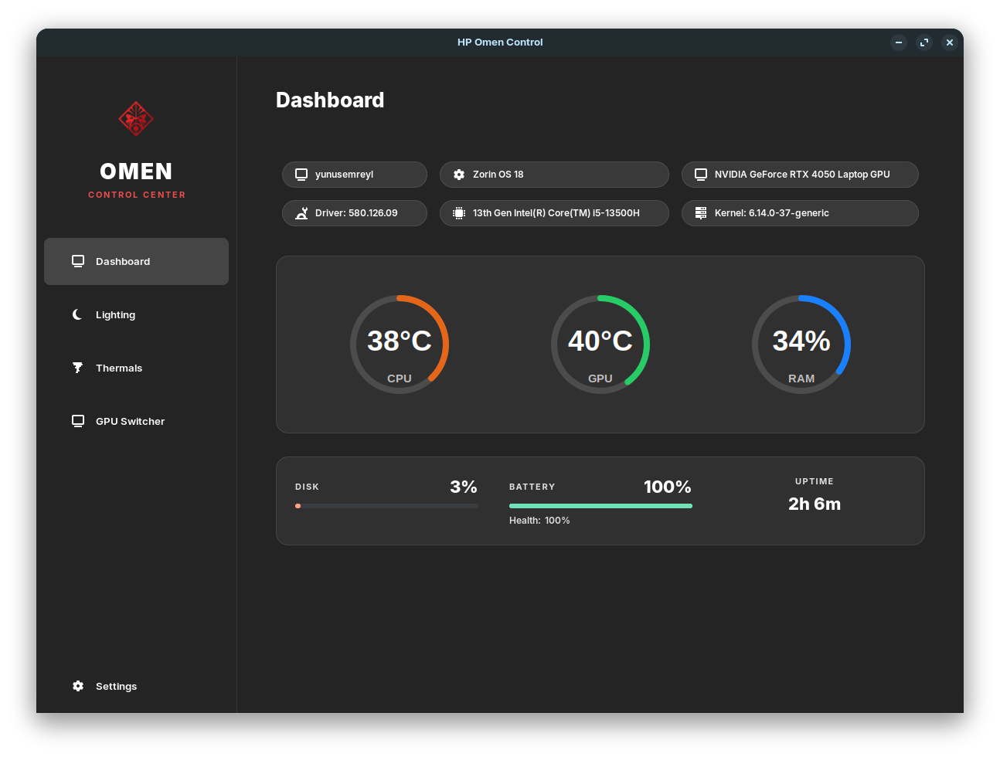
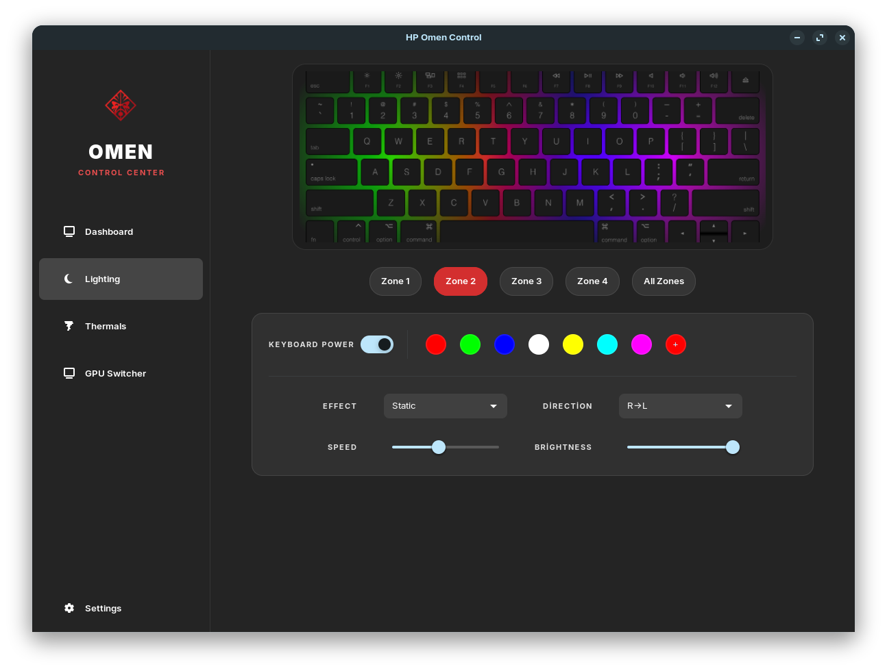
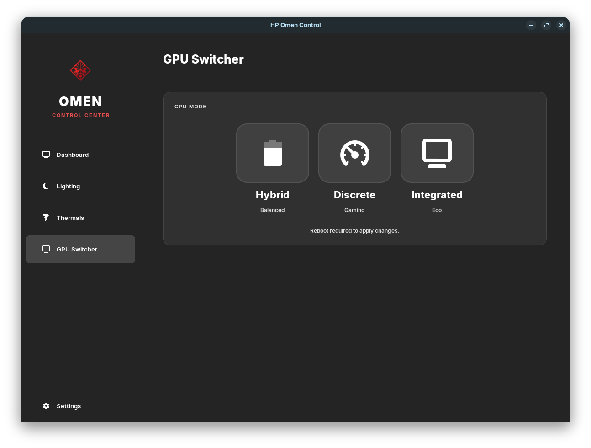

<div align="center">
  

  <h1>HP OMEN Control Center (Linux)</h1>
  
  <p>
    <b>The Missing Control Center for HP Omen & Victus Laptops on Linux</b>
  </p>

  
  
  
  

  <p>
    <a href="#features">Features</a> •
    <a href="#installation">Installation</a> •
    <a href="#compatibility">Compatibility</a> •
    <a href="#screenshots">Screenshots</a>
  </p>
</div>

---

## 📖 About The Project

**HP Omen Control Center** is a native Linux application designed to unlock the full potential of HP Omen and Victus series laptops. It serves as an open-source alternative to the official OMEN Gaming Hub, providing RGB lighting control, thermal monitoring, and GPU mode switching in a modern, lightweight interface.

Built with **Python, GTK4, and Libadwaita**, it blends perfectly with modern GNOME desktop environments (Ubuntu 24.04, Fedora 40, etc.).

## ✨ Features

### 🎨 RGB Lighting Control
* **4-Zone Control:** Independently set colors for all 4 zones of the keyboard.
* **Effects:** Support for **Static**, **Breathing**, **Wave**, and **Cycle** animations.
* **Customization:** Adjust animation speed and brightness (0-100%).
* **Driver:** Includes a custom C kernel module (`hp-omen-rgb`) managed automatically via **DKMS**.

### 📊 System Dashboard
* **Real-time Monitoring:** CPU, GPU, and RAM usage & temperatures.
* **Battery Stats:** Health percentage and charge level.
* **Disk & Uptime:** Visual indicators for disk usage and system uptime.

### 🎮 GPU MUX Switch
* **Hybrid Mode:** Standard Optimus mode (Battery life + Performance).
* **Discrete Mode:** Forces the dedicated NVIDIA GPU (Best for Gaming).
* **Integrated Mode:** Forces the iGPU (Best for Battery Life).
* *Powered by [EnvyControl](https://github.com/bayasdev/envycontrol).*

### 🛠️ Universal Installer
* **One-Click Setup:** Installs dependencies, compiles the driver, and sets up the background service automatically.
* **Multi-Distro Support:** Works on Debian/Ubuntu, Fedora, and Arch/Manjaro.

---

## 🚀 Installation

### 1. Clone the Repository
Open your terminal and clone the project:

```bash
git clone [https://github.com/yunusemreyl/Omen-Control-App.git](https://github.com/yunusemreyl/Omen-Control-App.git)
cd Omen-Control-App
2. Run the InstallerThe install.sh script handles everything (dependencies, driver compilation, service setup).Bashchmod +x install.sh
sudo ./install.sh
3. Done!You can now launch "HP Omen Control" from your application menu.Note: The installer uses DKMS, so the RGB driver will automatically rebuild itself when you update your Linux kernel. You don't need to reinstall after system updates.🗑️ UninstallationIf you want to remove the application, driver, and services completely:Bashchmod +x uninstall.sh
sudo ./uninstall.sh
This will leave no trace on your system.🐧 CompatibilityDistributionStatusNotesUbuntu 22.04 / 24.04✅ VerifiedFully supported via apt.Fedora 38+✅ VerifiedFully supported via dnf.Arch Linux / Manjaro✅ VerifiedFully supported via pacman.Pop!_OS✅ VerifiedWorks out of the box.Hardware Requirements:HP Omen or Victus Laptop with 4-Zone RGB Keyboard.Linux Kernel 6.1+ recommended.Note: Advanced fan control readings require Kernel 6.20+.📸 Screenshots<div align="center"></div><div align="center"></div>⚖️ Legal Disclaimer<div align="center" style="border: 1px solid #333; padding: 15px; border-radius: 8px; background-color: #1a1a1a;"><p><b>This tool is an independent open-source project developed by <a href="https://www.google.com/search?q=https://github.com/yunusemreyl">yunusemreyl</a>.</b></p><p>It is <b>NOT</b> affiliated with, endorsed by, or connected to <b>Hewlett Packard (HP)</b> or OMEN.The software is provided "as is", without warranty of any kind.</p></div>🤝 ContributingContributions, issues, and feature requests are welcome!Feel free to check the issues page.Fork the ProjectCreate your Feature Branch (git checkout -b feature/AmazingFeature)Commit your Changes (git commit -m 'Add some AmazingFeature')Push to the Branch (git push origin feature/AmazingFeature)Open a Pull Request<div align="center"><sub>Developed with ❤️ by <a href="https://www.google.com/search?q=https://github.com/yunusemreyl">yunusemreyl</a></sub></div>
