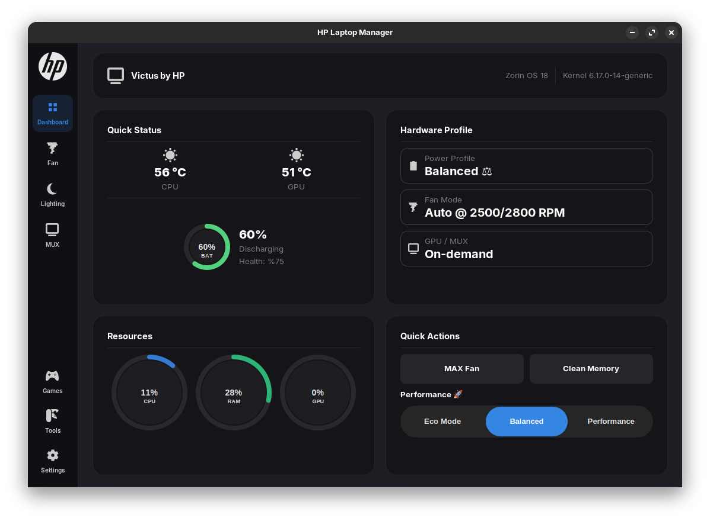
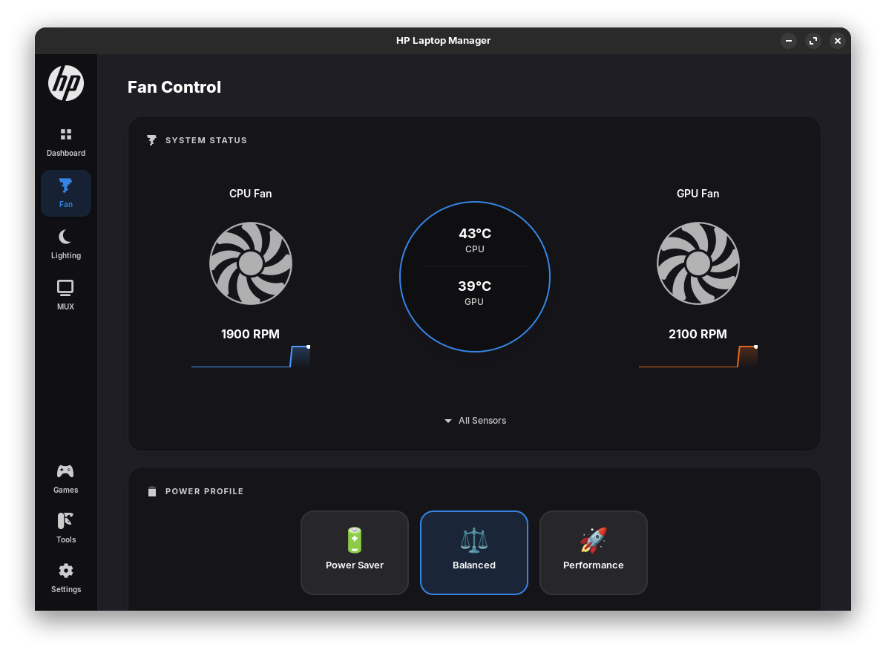
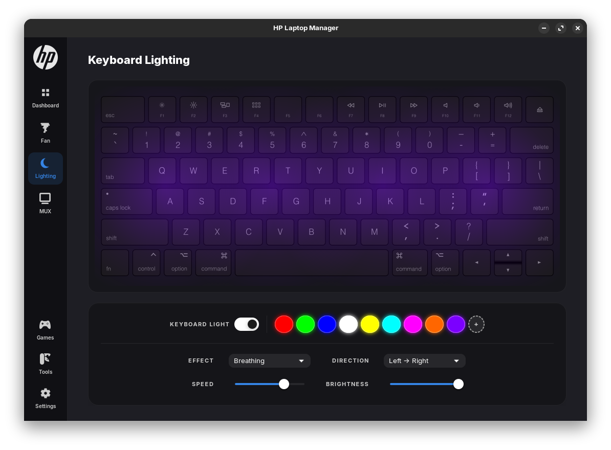
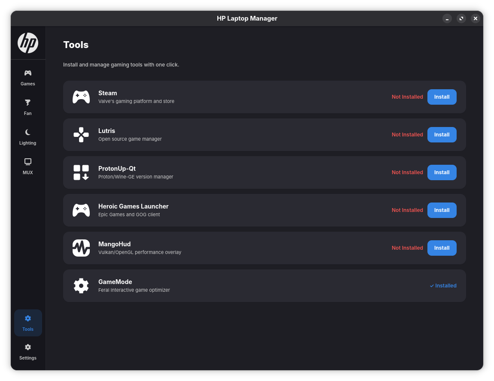
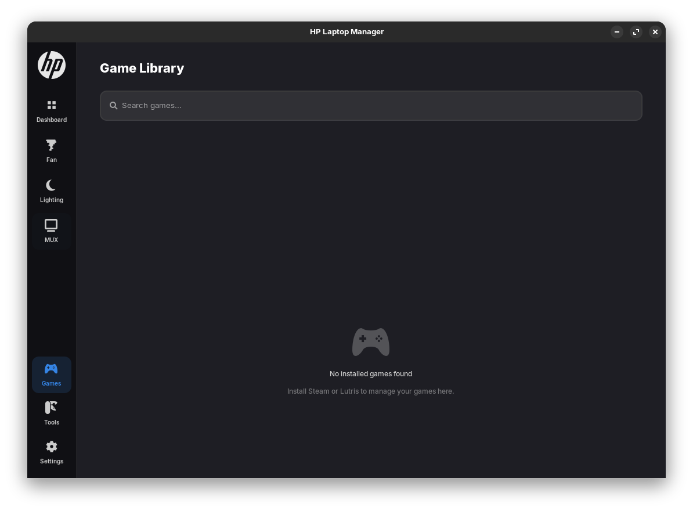
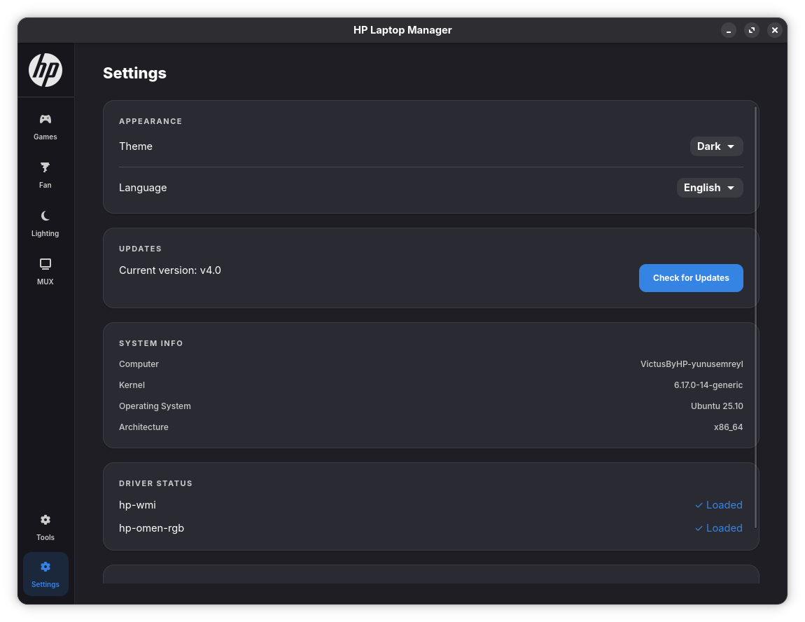

 # HP Laptop Manager (Linux) v1.0.0 #
<p align="center">
  

## 📖 About The Project
<p align="center">
  
  
</p>
<p align="center">
  
  
</p>
<p align="center">
  
  
</p>
<p align="center">
  
</p>

**HP Laptop Manager** is a native Linux application designed to unlock the full potential of HP Omen and Victus series laptops. It serves as an open-source alternative to the official OMEN Gaming Hub, providing essential controls in a modern, user-friendly interface.

**New in v1.0.0:**

> 📦 **Versioning Change**: Starting with this release, the project adopts **Semantic Versioning** (`major.minor.patch`) for a more professional and standardized release cycle. Previous versions (v4.x) have been remapped accordingly.

- 🔄 **Stock HP WMI Support**: On kernel 6.18+, the application now uses the **original HP WMI driver** shipped with the kernel for fan control — no custom WMI module needed.
- 🛠️ **Legacy Kernel Support**: For kernels **below 6.18**, the custom WMI driver (`hp-wmi`) is still bundled and the installer automatically installs it alongside `hp-omen-core`.
- ⚠️ **Secure Boot Notice**: Keyboard RGB control (`hp-omen-core`) is **not compatible with Secure Boot**. If Secure Boot is enabled, the `hp-omen-core` module cannot be loaded and keyboard lighting features will be unavailable. You must **disable Secure Boot** in BIOS to use keyboard control.
- 🔥 **Automatic Updates**: Check for and install updates directly from the Settings page — no need to re-clone or download manually.
- 🌡️ **Accurate GPU Temperature**: Fixed GPU temperature detection — correctly uses `nvidia-smi` with auto-detected PCI path, and never falls back to CPU package temperature.
- 🎨 **Performance Mode Colors**: Dashboard performance buttons now use distinct colors (green/blue/orange) instead of emojis.
- 🔋 **Battery-Safe GPU Polling**: Dashboard no longer wakes the dGPU from sleep — checks PCI suspend state before polling `nvidia-smi`.
- ⚡ **Smooth CPU Readings**: CPU usage display uses EMA smoothing to eliminate rapid fluctuations.
- 🎮 **Non-Blocking Game Scan**: Game library scanning runs in background — no more UI freezing when opening the Games tab.

## ✨ Features

### 🎨 RGB Lighting Control
- **4-Zone Control**: Customize colors for different keyboard zones.
- **Effects**: Static, Breathing, Wave, Cycle.
- **Brightness & Speed**: Adjustable parameters for dynamic effects.

### 📊 System Dashboard
- **Real-time Monitoring**: CPU/GPU temperatures and Fan speeds.
- **Performance Profiles**: One-click power profile switching (requires `power-profiles-daemon`).

### 🌪️ Fan Control
- **Standard Mode**: Intelligent software-controlled fan curve for balanced noise/performance.
- **Max Mode**: Forces fans to maximum speed for intensive tasks.
- **Custom Mode**: Drag-and-drop curve editor to create your own fan profiles.

### 🎮 GPU MUX Switch
- Switch between **Hybrid**, **Discrete**, and **Integrated** modes.
- *Note: Requires compatible tools like `envycontrol`, `supergfxctl`, or `prime-select`.*

## 🚀 Installation

### Prerequisites
- A Linux distribution (Ubuntu, Fedora, Arch, OpenSUSE, etc.)
- `git` installed

### Install
Open a terminal and run:

```bash
# Clone the repository
git clone https://github.com/yunusemreyl/LaptopManagerForHP.git
cd LaptopManagerForHP

# Run the installer (requires root)
chmod +x install.sh
sudo ./install.sh
```

The installer will automatically:
1. Detect your package manager and install dependencies.
2. Detect your kernel version and install the appropriate driver:
   - **Kernel ≥ 6.18**: Only installs `hp-omen-core` (RGB). Fan control is provided by the stock `hp-wmi` module.
   - **Kernel < 6.18**: Installs both the custom `hp-wmi` driver and `hp-omen-core`.
3. Install the daemon and GUI components.
4. Set up system services.
5. Provide a troubleshooting guide if issues occur.

> ⚠️ **Secure Boot Warning**: The `hp-omen-core` kernel module (keyboard RGB control) **cannot be loaded** when Secure Boot is enabled. If you need keyboard lighting control, you must disable Secure Boot from your BIOS settings. Fan control and other features work normally regardless of Secure Boot status on kernel 6.18+.

## 🗑️ Uninstallation

To completely remove the application and its services:

```bash
cd LaptopManagerForHP
chmod +x uninstall.sh
sudo ./uninstall.sh
```

## 🐧 Compatibility

| Distribution | Status | Notes |
|--------------|--------|-------|
| **Ubuntu 24.04 LTS / Zorin OS / Pop!_OS / Linux Mint** | ✅ Verified | Full support via `apt` |
| **Fedora 42+ / Nobara** | ✅ Verified | Full support via `dnf` |
| **Arch Linux / CachyOS / Manjaro** | ✅ Verified | Full support via `pacman` |
| **OpenSUSE Tumbleweed** | ✅ Verified | Full support via `zypper` |


## 👨‍💻 Credits & Acknowledgments
- **Lead Developer**: [yunusemreyl](https://github.com/yunusemreyl)
- **Kernel Module Development**: Special thanks to **[TUXOV](https://github.com/TUXOV/hp-wmi-fan-and-backlight-control)** for the `hp-wmi-fan-and-backlight-control` driver, which makes fan control possible.

## ⚖️ Legal Disclaimer
This tool is an independent open-source project developed by **yunusemreyl**.
It is **NOT** affiliated with or endorsed by **Hewlett-Packard (HP)**.
The software is provided “as is”, without warranty of any kind.

---
*Developed with ❤️ by yunusemreyl*
