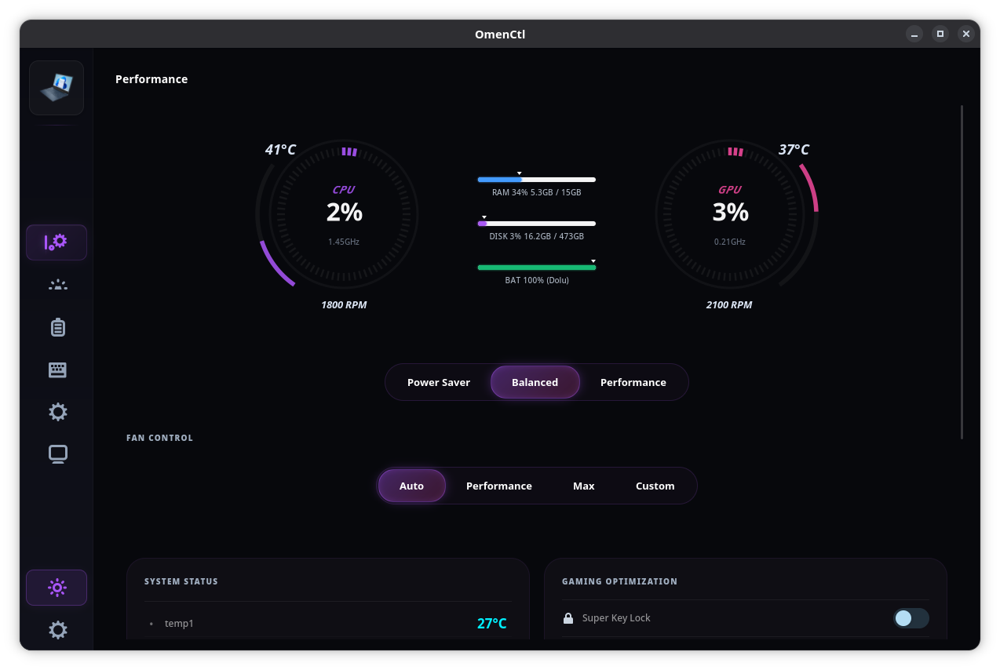
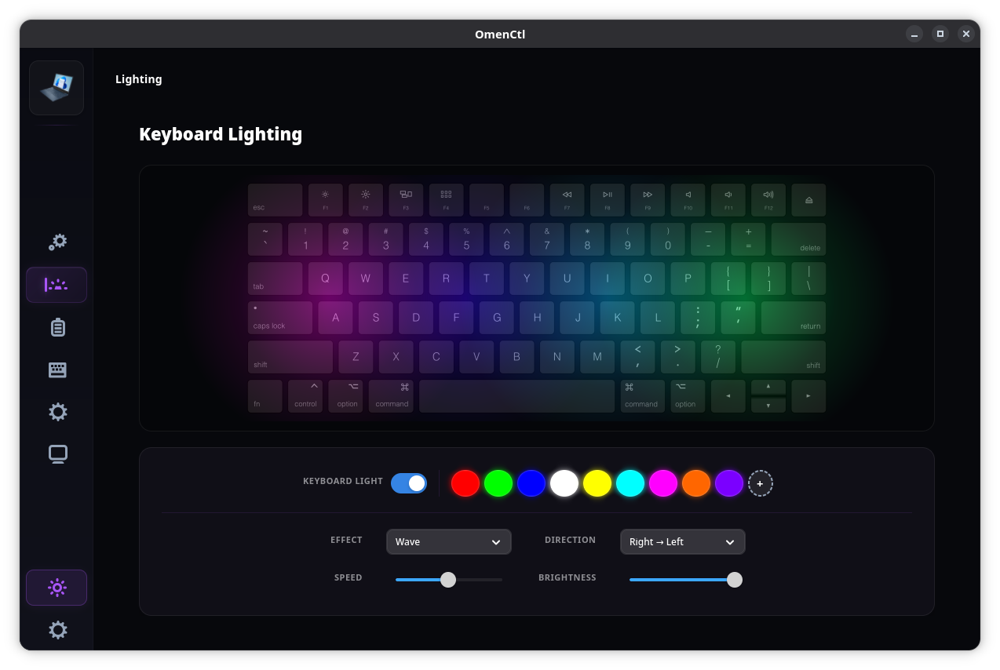
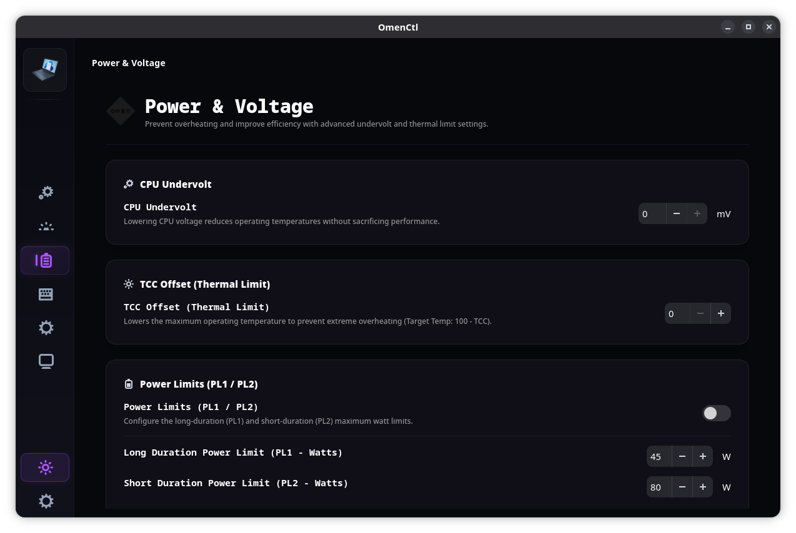
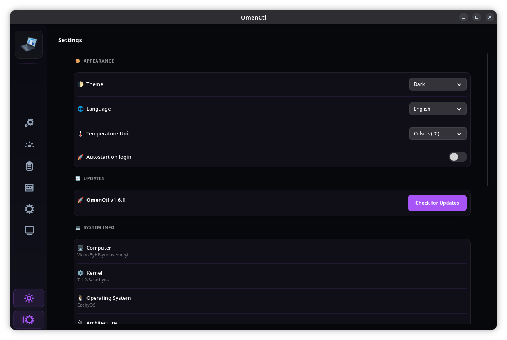

<div align="center">

```text
   ____                        ______ __ 
  / __ \____ ___  ___  ____   / ____// /_/ /
 / / / / __ `__ \/ _ \/ __ \ / /    / __/ / 
/ /_/ / / / / / /  __/ / / // /___ / /_ / / 
\____/_/ /_/ /_/\___/_/ /_/ \____/ \__//_/  
```


**Advanced Linux control center for HP Omen & Victus laptops.**
An open-source, root-daemon powered GTK4 tool for managing performance profiles, custom fan curves, RGB lighting, and hardware limits seamlessly on Linux.

[](LICENSE)
[]()

</div>

---

## ⚡ Features at a Glance

* **Fan & Thermal Mastery:** Create custom Fan curve splines with a 15-sample moving average deadband for near-silent operation without thermal throttling.
* **Power & Performance Switching:** Seamlessly toggle between `power-saver`, `balanced`, and `performance` hardware profiles.
* **MUX Switch Control:** Native interface for Optimus / dGPU routing switching (requires reboot, natively uses undocumented WMI payload `0x52`).
* **RGB Keyboard Lighting:** Configure your 4-Zone keyboard backlighting with wave, breathing, cycle, and static colors.
* **Application Automation:** Define custom power limits and fan curves for individual games (Steam, Lutris, Flatpak).
* **Macro & OMEN Key Mapping:** Remap the proprietary OMEN keys to custom shell scripts or keyboard macros.

---

## 🚀 Installation & Upgrades

### Prerequisites
* A modern Linux distribution (Ubuntu, Fedora, Arch Linux, OpenSUSE, CachyOS, etc.)
* `git`

### Quick Start
To install the latest stable release, run our unified web installer. This script will fetch the latest version, compile the custom kernel modules, and set up the SystemD daemon (`omenctld`).

```bash
# Download and run the web installer
curl -sL https://raw.githubusercontent.com/yunusemreyl/OmenCtl/main/install.sh | sudo bash
```

### For Developers (Bleeding Edge)
If you want to install the latest unreleased changes from the `main` branch:

```bash
git clone https://github.com/yunusemreyl/OmenCtl.git
cd OmenCtl
chmod +x setup.sh
sudo ./setup.sh
```

> **Note:** To upgrade an existing installation without losing your fan curves and settings, simply run `sudo ./setup.sh update`.

### Uninstallation
```bash
sudo ./setup.sh uninstall
```

*(For NixOS users, OmenCtl comes with built-in Nix Flake support. See the [flake.nix](flake.nix) or configuration samples).*

---

## 📖 Deep Dive Documentation

If you are a developer, a hardware tinkerer, or just curious about how we achieved WMI and EC (Embedded Controller) manipulation on Linux, check out the completely rewritten internal documentation:

* 🗺️ **[Documentation Home](documentation/README.md)**
* 🏗️ **[Architecture & Execution Flow](documentation/ARCHITECTURE.md)**: From a GTK4 button click, through D-Bus IPC, to the Daemon, and down to the hardware ACPI layer.
* 🛠️ **[Hardware Offsets & Registers](documentation/HARDWARE_OFFSETS.md)**: Detailed memory map for EC registers (`0x34`, `0x57`, etc.) and undocumented WMI CommandTypes used by HP BIOS.

---

## 📸 Screenshots

| Performance & Fan Curves | RGB Lighting |
| :---: | :---: |
|  |  |

| Power Tuning | Settings & Telemetry |
| :---: | :---: |
|  |  |

---

## 💻 Hardware & OS Support

* **Supported Product Families:** HP OMEN 15, 16, 17 | HP OMEN Transcend 14 & 16 | HP Victus 15 & 16
* **OS Compatibility:** 
  * ✅ **Ubuntu 24.04 LTS / Pop!_OS / Linux Mint** (`apt`)
  * ✅ **Fedora 42+ / Nobara** (`dnf`)
  * ✅ **Arch Linux / CachyOS / Manjaro** (`pacman`)
  * ✅ **OpenSUSE Tumbleweed** (`zypper`)

---

## 👨‍💻 Credits & Contributors

OmenCtl wouldn't exist without its amazing open-source community.

* **[yunusemreyl](https://github.com/yunusemreyl)** - Lead Developer
* **[tuxov](https://github.com/tuxov)** - Kernel Module Lead
* **[OmenLinux/omen-rgb-keyboard](https://github.com/OmenLinux/omen-rgb-keyboard)** - The kernel module providing hardware-accelerated RGB lighting effects.

### Top Contributors
[@CodesRahul96](https://github.com/CodesRahul96), [@xcellsior](https://github.com/xcellsior), [@TitoTFP](https://github.com/TitoTFP), [@SafSaf0999](https://github.com/SafSaf0999), [@yijean34-source](https://github.com/yijean34-source).

*(For the full list of community members and bug testers, check the commit history—thank you all!)*

---

## ⚖️ Legal Disclaimer

OmenCtl is licensed under the **GNU General Public License v3.0** (GPL-3.0). See the [LICENSE](LICENSE) file for details. 
*OmenCtl is an independent open-source project and is **NOT** officially affiliated with, authorized, or endorsed by **Hewlett-Packard (HP)**.*
