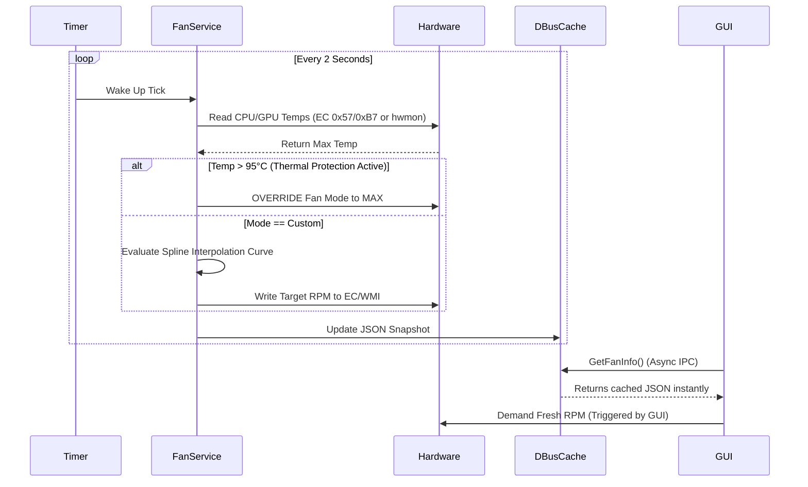
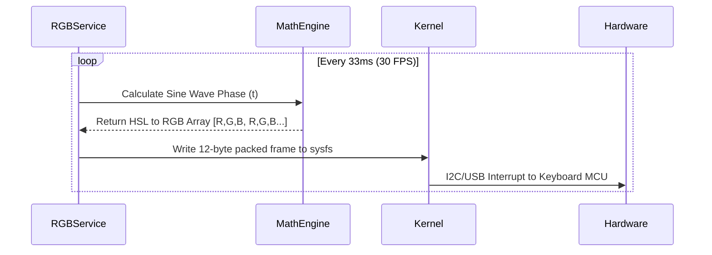

# OmenCtl Deep Architecture & Execution Map

OmenCtl is engineered using a robust client-server architecture to ensure that the unprivileged user interface remains incredibly fast, while the root-level background daemon safely handles the heavy lifting of direct hardware I/O and WMI execution.

This document serves as an exhaustive whitepaper on the internal mechanisms of OmenCtl.

---

## 1. Top-Level System Architecture Map

The following map illustrates how OmenCtl routes user intentions all the way down into the motherboard's firmware.

```mermaid
graph TD
    subgraph User Space (Unprivileged)
        A[OmenCtl GUI - GTK4]
        B[OmenTray Icon]
        A <--> |Non-blocking D-Bus IPC| C(D-Bus System Bus)
        B <--> |Non-blocking D-Bus IPC| C
    end

    subgraph Root Space (Daemon)
        C <--> |Signals & Methods| D[OmenCtld Daemon]
        D --> E{Service Routers}
        E --> F[Fan Service]
        E --> G[Power Service]
        E --> H[RGB Service]
        E --> I[MUX Service]
    end

    subgraph Hardware Abstraction (Kernel & Firmware)
        F --> |Sysfs Writes| J[hp-wmi Kernel Module]
        F -.-> |Direct Memory Writes| K[ec_sys DebugFS]
        G --> L[RyzenAdj / msr module]
        H --> M[hp-rgb-lighting Kernel Module]
        I --> M
        
        J --> N((ACPI WMI \n _SB.WMID))
        K -.-> O((Embedded Controller \n EC0))
        N --> O
    end
```

> [!NOTE]
> The GUI **never** waits for hardware. Hardware commands (like setting a fan curve or changing RGB) can take anywhere from 10ms to 500ms to execute at the firmware level. By decoupling the GUI from the Hardware via D-Bus, the UI maintains a constant 60+ FPS without stuttering.

---

## 2. Background Polling & Telemetry Loops

A critical part of the architecture is how telemetry (Temps, Fan RPMs, Power draw) is gathered without destroying battery life or causing DPC (Deferred Procedure Call) latency spikes.

### The Fan & Thermal Monitor Loop (`_monitor_loop`)
Inside `src/daemon/services/fan_service.py`, a dedicated background thread runs continuously.



#### Why is this design important?
1. **Interrupt Storm Prevention:** Querying WMI or the Embedded Controller too frequently (e.g., > 1 time per second) triggers ACPI lock contention on HP motherboards. This causes the laptop fans to stutter or spin up briefly due to firmware panic.
2. **On-Demand Polling:** While the background loop handles critical thermal protection every 2 seconds, heavy metrics (like individual Fan RPMs) are fetched **on-demand** only when the GUI explicitly asks for them, reducing background idle CPU usage to 0%.

### Spline Interpolation & Deadbands
When in "Custom" fan mode, `fan_service` evaluates a user-defined curve. OmenCtl uses a **15-sample moving average deadband**.
Instead of responding instantly to a CPU temperature spike (e.g., hitting 90°C for 1 second during a compiler burst), the system averages the last 15 temperature readings over a 30-second sliding window. This prevents the fans from nervously spinning up and down ("pulsing"), providing a near-silent desktop experience.

---

## 3. The Zero-Overhead RGB Animation Engine

Keyboard backlighting on Omen laptops natively only supports "Static" colors via WMI. To achieve Breathing, Wave, and Cycle effects, the daemon must manually compute and push color frames to the keyboard 20-30 times per second.


**Optimization Detail:** To prevent python's GIL (Global Interpreter Lock) from causing animation stutter, the `rgb_service.py` calculates the entire HSV-to-RGB transition matrix using fast bitwise math, packing exactly 4 zones of RGB data (12 bytes total) and writing it directly to the custom `/sys/devices/platform/hp-rgb-lighting/` kernel module.

---

## 4. Execution Flow: "Set Performance Mode"

Let's trace exactly what happens when a user clicks the "Performance" button.

1. **GUI Layer:** User clicks the `Performance` toggle button in `power_page.py`.
2. **D-Bus Call:** The GUI executes `power_svc.SetPowerProfile("performance")` over the `pydbus` proxy.
3. **Daemon Reception:** `power_service.py` receives the command. It writes the configuration to disk (`~/.config/omenctld/power.json`) so the state persists across reboots.
4. **Hardware Dispatch:** The daemon tells the `fan_service` to set the thermal profile to `performance`.
5. **Sysfs Write:** The daemon writes the integer `1` to `/sys/devices/platform/hp-wmi/thermal_profile`.
6. **Kernel Execution (`hp-wmi.c`):** The Linux kernel `hp-wmi` driver catches this write. It packages the value `1` into a 128-byte data buffer.
7. **ACPI WMI Call:** The kernel executes the ACPI method `_SB.WMID.WQBZ` with `CommandType = 0x11` (ThermalControl).
8. **Firmware Magic:** The BIOS receives the ACPI payload. It raises the cTGP (Total Graphics Power) limit of the NVIDIA GPU from 80W to 115W, increases the CPU PL1/PL2 power limits, and instructs the Embedded Controller to apply an aggressive internal fan curve.

---

## 5. D-Bus Interface Specifications

For developers looking to integrate OmenCtl into their own scripts (or tools like Waybar/Polybar), here are the exposed D-Bus interfaces running on the `System Bus`:

### `com.yyl.hpmanager.fan`
- **`GetFanInfo()`**: Returns a JSON string containing the current snapshot of fans, speeds, and max RPMs.
- **`GetFanMode()`**: Returns current mode (`auto`, `max`, `custom`, `performance`).
- **`SetFanMode(mode: String)`**: Sets the fan mode.
- **`SetCustomCurve(curve: String)`**: Accepts a JSON array of `[temperature, percentage]` pairs.

### `com.yyl.hpmanager.power`
- **`GetPowerProfile()`**: Returns JSON of `available` status and `active` profile.
- **`SetPowerProfile(profile: String)`**: Accepts `power-saver`, `balanced`, or `performance`.
- **`SetUndervolt(core: Int, cache: Int)`**: Applies intel MSR or RyzenAdj voltage offsets natively.

### `com.yyl.hpmanager.rgb`
- **`SetMode(mode: String)`**: Accepts `off`, `static`, `breathe`, `wave`, `cycle`.
- **`SetColor(color_hex: String)`**: Accepts a hex string (e.g., `#FF0000`).

### `com.yyl.hpmanager.mux`
- **`GetGpuInfo()`**: Returns JSON containing available GPUs and current mode.
- **`SetGpuMode(mode: String)`**: Accepts `hybrid` or `discrete` (Flags the BIOS for reboot).
