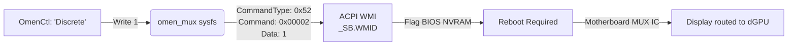

# Hardware Offsets & WMI Command Maps

This document is the master reference for the hardware registers, memory offsets, and ACPI WMI buffers used by OmenCtl. Understanding this map is essential for reverse-engineering new OMEN laptops or debugging hardware interactions.

---

## 1. The Evolution of HP OMEN Hardware: V1 vs. V2

When developing for OmenCtl, it is crucial to understand the architectural shift HP made between 2022 and 2023.

| Architecture | HP V1 (Legacy) | HP V2 (Modern) |
| :--- | :--- | :--- |
| **Era** | 2020 - 2022 (e.g., OMEN 15-ek, 15-en) | 2023 - Present (e.g., OMEN 16-wf, Transcend) |
| **Control Method** | Direct Embedded Controller (EC) memory writes | Strict ACPI WMI data buffers |
| **Safety** | High risk of kernel panic if offsets change | Protected by BIOS boundaries |
| **Thermal Command** | WMI `CommandType 0x11` (or EC `0x95`) | WMI `CommandType 0x08` (or `WQBZ` GUID) |
| **Fan Manipulation** | Directly via EC offsets `0x2E` & `0x2F` | Indirectly via WMI custom curve arrays |

> [!CAUTION]
> **Do NOT write to legacy EC offsets on V2 hardware.** On modern boards (like the OMEN 16 2023/2024), the EC memory map has completely changed. Writing a fan speed to `0x2E` on a V2 board will overwrite critical system memory, causing an instant hardware lockup and sudden power loss.

---

## 2. Legacy Embedded Controller (EC) Offsets (V1 Hardware)

On supported legacy models, OmenCtl interacts with the Linux EC debug module (`ec_sys`) mounted at `/sys/kernel/debug/ec/ec0/io`. Writing bytes to these specific offsets controls hardware behavior by bypassing the OS and ACPI entirely.

### Fan & Thermal Registers

| Register (Hex) | Name | Valid Payload Values | Description / Behavior |
| :---: | :--- | :--- | :--- |
| `0x2E` | Fan 1 Speed (%) | `0x00` - `0x64` (0 to 100) | Sets the primary (CPU) fan speed as a percentage. |
| `0x2F` | Fan 2 Speed (%) | `0x00` - `0x64` (0 to 100) | Sets the secondary (GPU) fan speed as a percentage. |
| `0x34` | Fan 1 RPM Target | `0x00` - `0x3C` (0 to 60) | Sets target speed in units of 100 RPM. E.g., Writing `0x28` (40) sets the target to 4000 RPM. |
| `0x35` | Fan 2 RPM Target | `0x00` - `0x3C` (0 to 60) | Sets target speed in units of 100 RPM for Fan 2. |
| `0xEC` | Fan Boost Toggle | `0x00` (Off)   `0x0C` (Boost Max) | Overrides all curves and forces fans to absolute maximum voltage. |
| `0xF4` | Fan State | `0x00` (Enabled/Auto)   `0x02` (Disabled) | Used to temporarily disable the EC's internal fan curve before writing custom RPM targets. |
| `0x57` | CPU Temp Readout | `0x00` - `0x73` (0 to 115°C) | Real-time EC CPU temperature readout in Celsius. |
| `0xB7` | GPU Temp Readout | `0x00` - `0x73` (0 to 115°C) | Real-time EC GPU temperature readout in Celsius. |

### Performance Profile Registers

The performance mode determines the system power limits (PL1/PL2) and internal EC fan aggressiveness.

| Register | Models | Default/Balanced | Performance Mode | Cool/Eco Mode |
| :---: | :--- | :---: | :---: | :---: |
| **`0x95`** | Standard Legacy (OMEN 15) | `0x30` | `0x31` | `0x50` |
| **`0x59`** | Fallback Boards (8E35, 8A43) | `0x30` | `0x31` | `0x50` |

> [!TIP]
> The `0x59` fallback is exclusively used for specific broken BIOS revisions where the standard `hp-wmi` ThermalControl `0x11` method fails silently. OmenCtl's capability database automatically detects these boards and routes power profile changes to `0x59` instead of WMI.

---

## 3. ACPI WMI Command Maps (V2 Hardware)

Most modern Omen laptops (2022+) use the `hp-wmi` Linux driver. This driver wraps complex ACPI WMI calls into simple `sysfs` nodes. OmenCtl interacts with these nodes, and the kernel does the heavy lifting of packing the WMI buffers.

### Thermal Profiles
Controlled via `/sys/devices/platform/hp-wmi/thermal_profile`
* **WMI Command Payload:** CommandType `0x11` (ThermalControl)
* **Writes:**
  - `0`: Balanced
  - `1`: Performance (Increases NVIDIA Total Graphics Power (cTGP) limits)
  - `2`: Cool

### Advanced MUX Switch (GPU Mode)
The MUX switch controls whether the internal laptop display is electrically routed through the iGPU (Hybrid/Optimus) or the dGPU (Discrete). OmenCtl includes a custom driver extension (`hp-rgb-lighting.c`) that hooks the undocumented HP WMI MUX interface and exposes it to `/sys/devices/platform/hp-rgb-lighting/omen_mux`.

* **WMI Method Payload:** CommandType `0x52`, Command `0x00002`
* **Writes:**
  - `0`: Hybrid (Optimus) Mode
  - `1`: Discrete (dGPU only) Mode
